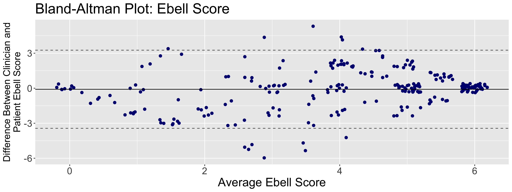

<style>
p.caption {
  font-size: .73em;
}
</style>

```{r setup, include=FALSE}
knitr::opts_chunk$set(echo = FALSE)
library(flextable)
```

# Introduction

**Motivation: Triage telemedicine could be used as a tool to reduce burden on the healthcare system and limit exposure. Triage telemedicine for influenza designates patients into a risk class for having influenza based off of patient reported symptom data.**

* Currently Clinical Prediction Rules (CPRs) that were designed using clinician reported data are used in telemedicine. 
* Previous research shows that patients and clinicians often disagree on symptoms reporting.
* Patients and clinicians each filled out a 19 symptom questionnaire during the 2016-2017 influenza season at a University Health Center 

**Question:  Is the disagreement on reported symptoms enough to make clinical prediction rules made from clinician based reports ineffective in telemedicine settings?  If so, can we make an effective CPR that is based off of patient reported symptoms?**

# Clinical Prediction Rules 
We evaluated and compared our model performance to two previous CPRs:

**Ebell Score:** Points are added together based on the combination of symptoms the patient has. 

* 2 points are assigned for fever and cough
* 2 points assigned for myalgias
* 1 point each for duration < 48 hours and chills or sweats 

**Afonso Tree:** The Afonso Tree follows a decision tree to determine the risk of the patient.
```{r, out.width ='95%', fig.align = "center", fig.cap= "The Alfonso Decision Tree separates patients into low, moderate, and high risk categories based on reported symptoms. The low risk group is advised to stay at home, whereas the moderate and high risk are advised to visit the doctor's office."}

```
# Results

**1. Patients and Clinicians often disagree on the reported symptoms.** 
```{r, out.width= "95%",out.height= "60%",fig.cap="The Cohen Kappa statistic is used to measure the inter-rater reliability.  Most of the symptoms have a poor kappa measurement. Overall, the clinician and patient do not agree on the presence of the symptoms."}
knitr::include_graphics("Figures/kappas.png")
```
**2. Patient reported symptom data can not be substituted in for clinician reported symptom data in a clinician based CPR.**
```{r,out.height="70%", out.width= "95%", fig.cap="The large scatter shows that patient and clinician symptoms data disagree enough to be deemed invalid substitues."}

```
**3. Using patient versus clinician reported data could lead to a different risk class and can lead to different advised care.** 
```{r, out.width= "95%", fig.cap="Using the patient reported data there is a larger percent of patients in the moderate risk category than when using clinician reported data.  The moderate risk group is advised to visit the doctor's office for further evalution. Using the patient versus clinician reported data can lead to different care recommendations."}
knitr::include_graphics("Figures/riskgrouppercent.png")
```
**4. Risk prediction models which are fit to patient data were implemented and slightly improved upon the clinician based CPRs. These models could be used to build a patient based CPR.**
```{r,out.width="95%", fig.cap="The Random Forest model slightly outperforms the other model types.  Due to the complexity of the Random Forest algorithm, the Lasso model would be a more practical model to build a patient based CPR from. The clinican based CPRs had a AUC of .69, therefore a patient based CPR improves the Area Under the Roc Curve (AUC) slighty. AUC is used to measure the overall accuracy of a model."}
knitr::include_graphics("Figures/modeleval-pcr.png")
```

# Conclusions

* A clinician based CPR cannot be effectively used with patient reported symptom data, like in telemedicine.

* Using our patient-fit models a CPR for telemedicine could be created from this model by assigning weights to symptoms 

* Because the patient-based model only showed minimal improvement, a combination of at home testing and a patient based CPR would be the best approach to influenza triage telemedicine.

# Acknowledgments

Support for this research was provided by the National Science Foundation (grant #1659683) through the Population Biology of Infectious Diseases Undergraduate Research program.

<div style = "font-size: 30px;">
1. Afonso, A. M., M. H. Ebell, R. Gonzales, J. Stein, B. Genton, and N. Senn. 2012. The use of classification and regression trees to predict the likelihood of seasonal influenza. Family Practice 29:671–677.
2. Ebell, M. H., I. Rahmatullah, X. Cai, M. Bentivegna, C. Hulme, M. Thompson, and B. Lutz. 2021. A Systematic Review of Clinical Prediction Rules for the Diagnosis of Influenza. The Journal of the American Board of Family Medicine 34:1123–1140.
3. Ebell, M. H., A. M. Afonso, R. Gonzales, J. Stein, B. Genton, and N. Senn. 2012. Development and Validation of a Clinical Decision Rule for the Diagnosis of Influenza. The Journal of the American Board of Family Medicine 25:55–62.
</div>
