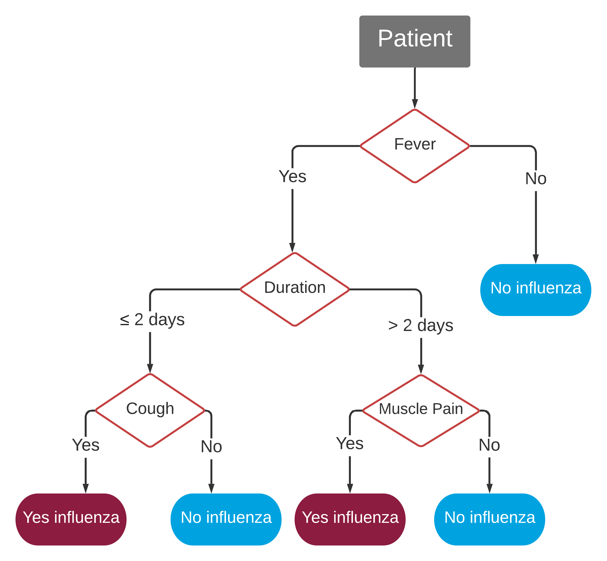

```{r setup, include=FALSE}
knitr::opts_chunk$set(echo = FALSE)
```
<style>
.logo_left, .logo_right {
 width: 15%;
 height: 70%;
 padding-top: 1em;
}
.poster_title {
width: 70%;
padding-top: 1em;
}
body {
text-align: left;
}
p.caption {
  font-size: 0.9em;
}
.special {
  font-size: 0.94em
}
</style>

# Introduction

**Motivation: During a public health crisis, telemedicine could be used as a tool to triage patients and prevent stress on the health care system. If a patient can get the same diagnosis without an in person visit, burden on the healthcare system could be reduced.**

**Question: Can a patient symptom questionnaire be used to predict influenza diagnosis by a physician?**


* Data collected in previous study at UGA's University Health Center during the 2016-2017 flu season (1).
* A symptom questionnaire containing 19 symptom pairs was given to both patients and clinicians: 
  * Patients filled out symptom questionnaire before the appointment
  * Clinicians filled out symptom questionnaire during the appointment

# Clinical Decision Rules
**We applied 5 clinical decision rules:**
<div style ="float:right;margin-right: 20px;margin-bottom: 5px" markdown="1">
{width=800px}
</div>
* CF (Cough-Fever Rule): Influenza diagnosed if cough and fever are both present
* CFA (Cough-Fever-Acute Onset Rule): Influenza diagnosed if cough and fever are both present for ≤ 2 days
* CFM (Cough-Fever-Myalgia Rule): Influenza diagnosed if cough, fever and muscle pain are all present
* Weighted Flu Score: 2 points given if cough and fever are both present, 2 points given for muscle pain, 1 point for chills/sweats and 1 point if symptoms are present for <= 2 days (3)
* Decision tree: See upper right figure. (2)


<!-- ```{r fig1, out.width='40%', fig.align="center"} -->
<!-- knitr::include_graphics( -->
<!--  here::here("8 Auxiliary", "Jackies_REU_poster", "Figures/Algorithm flowchart example.png")) -->
<!-- ``` -->

<br>
<br>

# Results
<center>**We found that the clinician's symptom questionnaire outperforms the patient's when predicting influenza diagnosis.**</center>
<div style="padding: 12pt;">

```{r fig4, out.width='100%', fig.cap=""}
CI_table <- readRDS(here::here("8 Auxiliary", "Jackies_REU_poster",
                               "Figures/CI_table.Rda"))
CI_table$score <- c("CF", "CFA", "CFM", "Score", "Tree")
colnames(CI_table) <- c("Decision Rule", "Clinician AUC", "Patient AUC", "Difference", "95% CI")
knitr::kable(CI_table, caption = "The area under the ROC curve (AUC) is an overall measurement of accuracy. We saw a reduction in AUC using the patient questionaire instead of the clinician's.")
```

</div>

```{r fig3, out.width='95%', fig.align = "center", fig.cap ="The ROC curves for each clincial decision rule."}
knitr::include_graphics(
  here::here("8 Auxiliary", "Jackies_REU_poster", "Figures/Diagnosis_ROCS.png"))
```

 
<center>**The clinicians outperformed the patients across multiple performance measures.**</center>
```{r fig5, out.width='95%', fig.align = "center", fig.cap="The closer F1, MCC, sensitivity and specificity are to 1, the better the prediction performance."}
knitr::include_graphics(
  here::here("8 Auxiliary", "Jackies_REU_poster", "Figures/Metrics.png"))
```
<center>**In a sensitivity analysis, we evaluated the clinical decision rules ability to predict PCR confirmed flu status.**</center>
<div style="padding: 12pt;">
```{r fig7, out.width='95%'}
CI_table <- readRDS(here::here("8 Auxiliary", "Jackies_REU_poster",
                               "Figures/PCR_CI_table.Rda"))
CI_table$score <- c("CF", "CFA", "CFM", "Score", "Tree")
colnames(CI_table) <- c("Decision Rule", "Clinician AUC", "Patient AUC", "Difference", "95% CI")
knitr::kable(CI_table, caption = "Comparing AUCs, we found the differences between patients and clinicians are smaller.")
```
</div>

<div style="padding: 12pt;">
<center>**The difference in performance may be explained by the lack of agreement between patients and clinicians.**</center>
```{r fig6, out.width='100%', fig.align = "center", fig.cap="We used Cohen's kappa to quantify agreement between the patient and clinician. "}
knitr::include_graphics(
  here::here("8 Auxiliary", "Jackies_REU_poster", "Figures/KappaPlot_c.png"))
```
</div>


# Conclusion
<!-- * The performance of the clinical decision rules for the patient and clinician rules is statistically significant. -->
* While the loss in accuracy from patient reported symptoms is statistically significant, the clinical significance needs to be evaluated in further studies.
* The weighted flu score performed better than the simple heuristic rules for both patient and clinicians in our population.


The NSF provided funding through the Population Biology of Infectious Diseases REU site (grant number 1659683).
<div style = "font-size: 30px;">
1. Dale AP, et. al. 2019. *The Journal of the American Board of Family Medicine* 32(2):226–33.
2. Afonso, et. al. 2012. *Family Practice*  29(6):671–677.
3. Ebell, et. al. 2012. *The Journal of the American Board of Family Medicine* 25(1):55-62.
</div>

<!-- 1. Zarnitsyna VI, et al. 2016. *PLoS Pathog* 12(6):e1005692. -->
<!-- 2. Ross TM, et al. 2014. *Hum Vaccin Immunother* 10(5):1195--1203. -->
</div>
